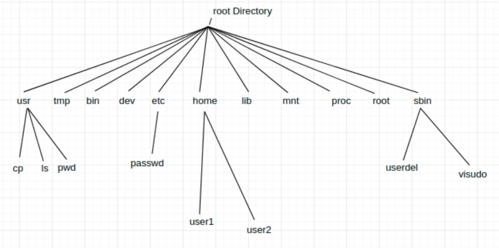

# Day one, Morning, Navigating the system

> Add the flag to the corner of your screen 

## Before start

To start this tutorial you need to be logged in the Linux virtual machine
[vlinux.humboldt.edu](https://vlinux.humboldt.edu/) please use your Cal Poly Humboldt credentials

For best visualization we recomend of the virtual machine:
- Change the remote desktop to fit into the window

The virtual machine is a virtual Linux computer runing in a server through the PC you are using. Linux based systems are typically used in bioinformatic environments, hence the importance of getting familiarized with them.


### Open terminal

Once logged in the Linux machine, look for the Terminal, it is an icon that contains the characters '>\_'

You can also write 'terminal' in the search bar of the main manu located in the left bottom of the operating system.


> Note: Macs also have a linux based Terminal. Go to: Applications > Utilities > Terminal.app or you can search in Spotlight: search write `terminal` and press <kbd>Return</kbd>.

> Note for Windows users: you can install linux in your computer installing a virtual in your computer [installing a virtual machine](https://github.com/merlyescalona/ucsc-eeb-intro2comptools/tree/master/week_00#using-a-virtual-machine) for set up.

> Remove your flag if you are good to continue 

## The Unix shell / terminal / command-line

The Unix shell is both a command-line interface (CLI) and a scripting language, allowing such repetitive tasks to be done automatically and fast. With the proper commands, the shell can repeat tasks with or without some modification as many times as we want. 

The shell is a program where users can type commands. With the shell, it’s possible to invoke complicated programs like climate modeling software or simple commands that create an empty directory with only one line of code. The most popular Unix shell is `Bash` (the **B**ourne **A**gain **SH**ell — so-called because it’s derived from a shell written by Stephen Bourne). `Bash` is the default shell on most modern implementations of Unix.

Using the shell will take some effort and some time to learn. While a graphic user interfaces (GUI) presents you with choices to select, CLI choices are not automatically presented to you, so you must learn a few commands like new vocabulary in a language you’re studying. However, unlike a spoken language, a small number of "words" (i.e. commands) gets you a long way.

The grammar of a shell allows you to combine, in an almost unlimited fashion, existing tools into powerful pipelines and handle large volumes of data automatically. Sequences of commands can be written into a script, improving the reproducibility of workflows.

In addition, the command line is often the easiest way to interact with remote machines and supercomputers. Familiarity with the shell is near essential to run a variety of specialized tools and resources including high-performance computing systems. As clusters and cloud computing systems become more popular for scientific data crunching, being able to interact with the shell is becoming a necessary skill. We can build on the command-line skills covered here to tackle a wide range of scientific questions and computational challenges.

---

[Source: the Software Carpentry, Data Carpentry, and Library Carpentry instructional material](http://swcarpentry.github.io/shell-novice/01-intro/index.html) 

*Under the Creative Commons Attribution license ([CC BY 4.0](https://creativecommons.org/licenses/by/4.0/))*

## Navigation of your computer using terminal

> Add the flag to the corner of your screen 

Now that you have open terminal you will see a black screen waiting for commands. First we need to know where in the computer we are located by typing:

```
pwd
```
now press <kbd>return</kbd>

`pwd` prints a complete path to your present working directory. Now that we know our location in the computer. The default location after you have open terminal is your `home` directory 

### Files and directories

Directories are the Unix equivalent of folders on a PC or Mac. They are organised in a hierarchy, so directories can have sub-directories and so on. 

For reference here is the general file structure in Linux-based systems


*[Source: devOpsAGE](https://www.devopsage.com/file-system-hierarchy-of-linux/)*

### Structure of a pahtname


*[Source: eTutorials.org](http://etutorials.org/Linux+systems/red+hat+linux+9+professional+secrets/Part+II+Exploring+Red+Hat+Linux/Chapter+7+Red+Hat+Linux+Basics/Understanding+the+Linux+File+System/)*

If there is a file called `genome.seq` in the `dna` directory its location or full path can be
expressed as `/home/user/dna/genome.seq`. The full path can be also referred as **absolute path**.
If we are under the directory `/home/user/`, and we would like to write the **relative path** of 
the  same file, we would do it like: `dna/genome.seq` or `./dna/genome.seq`.

The location or directory that you are in is referred to as the **current working directory**.

There are some short cuts for referring to directories:
- `.`: Current directory (one full stop)
- `..`: Directory above (two full stops)
- `~`: Home directory (tilde)
- `/`: Root of the file system (like C: in Windows)

# Hands-on

We can list the contents of the directory by typing:

```
ls
```

The command `ls` can be accompanied with several options to provide more details about the items found inside the folder. For example the option `-l` includes a longer description of the items.

```
ls -l
```

The `ls -a` option shows All files, including the ones that start with ".", these files are hiddend files usually not shown on your screen.

```
ls -a
```

Do you have any hidden files in your folder?

You can combine different options to obtain the information desired by using the options `-la` together the output will show you Longer details of items, including hidden files.

> What are the hidden files? these files are generated by some programs to keep track of the edits being made (i.e. text editors), configurations or logs.

```
ls -la
```

You can find about all the options a command has by typing:

```
man ls
```

Stuck in the window? You can scroll with the spacebar and/or with the arrows of you keyboard. If you want to exit the informative screen just type `q`.

A friendly combination of options for `ls` is:

```
ls -lah
```

**Can you tell us what does the options `-h` do?**

> Remove your flag if you are good to continue 

### Creating directories

Now that you know to identify your working directory and list the items now we will learn how to created directories and move across directories.

> Add the flag to the corner of your screen 

Let's move into the Documents folder:

```
cd Documents
```

Let's create a directory to keep our files organized

```
mkdir day 1
```
What happened?

The command line interprets `day` and `1` as different arguments.

***From now on avoid using spaces in file and folder names, use _ instead***

We can remove both unwanted directories by typing 

```
rmdir day 1 
```

Now, let's create a new directory labeled `day_01` by typing:

```
mkdir day_01
```

List the items inside your working directory and confirm the folder has been created

```
ls
```

To Change Directories into the newly created folder type:

```
cd day_01
```

you can check that you are really there by checking your Present Working Directory `pwd`

If you want to go back to the parent directory you simply type:

```
cd ..
```

You can always return to your `home` directory by:

```
cd
```
***TIP:*** When the terminal is ready to recibe your command, you can go back earlier commands by simply pressing the up arrow key <kbd>↑</kbd>


***TIP:*** To change directories type `cd ` and then **drag and drop** the folder you want to go. This will reduce the ammount of typing if the desired folder you wat to relocate to is too nested in the file hierarchy. let's drag and drop the folder `day_01` in after typing `cd `, then press <kbd>enter</kbd>

You can see that the drag and drop method adds the absolute path of the folder instead of the relative path.

> Remove your flag if you are good to continue 

### Creating and managing files

> Add the flag to the corner of your screen 

A practical way to create a file is to use the text editor `nano`. Let's create a new file by typing:

```
cd ~/Documents/day_01
nano log.txt
```

After excecuting the command nano will open and you can start adding text to your new file, let's type:

```
I love coding

at Cal Poly Humboldt
```

Notice that at the bottom of the window, there are commands instructions. To exit and save press:

<kbd>control</kbd> + <kbd>x</kbd>

Then answer:

<kbd>y</kbd>

Finally press:

<kbd>return</kbd>

If you `ls` your new file should appear there. We can print the contect of a file to the screen easily by typing:

```
cat log.txt
```

`cat` is an useful program taht can be use to print the contents of any file to the screen. It can also be used to concatenate files.

***TIP:*** When typing file and folder names you can press the `tab` key to autocomplete a name, notice that the letters typed have to be long enough to match only a single item. In this case just by typing `cat log` and then pressing <kbd>tab</kbd> we should be able to obtain the complete command desired.

> Remove your flag if you are good to continue 

It turns out that we want `log.txt` inside a folder called `personal_entries`. First we need to create the directory by:

> Add the flag to the corner of your screen 

```
mkdir personal
```

Now we need to move our text file inside the new folder, notice that the command works like this `mv path_origin path_destination`.

```
mv log.txt personal/
```

Check the file was moved by listing the contents of `personal` typing:

```
ls personal
```

`mv` can also be used to rename files, let's remane `log.txt` with `log_01.txt`

```
cd personal
mv log.txt log_01.txt
```

Finally we can make a copy of `log_001.txt` to create a second file:

```
cp log_01.txt log_02.r
```

we can check the contents of the copied file:

```
cat log_02.r
```

Notice that regarding the extension of the file `.txt` / `.r` cat prints the contents of the file to the screen.

> Remove your flag if you are good to continue 


## Cancel a running process

> Add the flag to the corner of your screen 

Sometimes an unwanted process happens in our terminal, perhaps we `cat` a really long file or we just insert a typo in the command line. We can simulate an unwanted process by just typing:

```
cat
```

You might think that the terminal is stuck, that we might have missed and argument for `cat`, but `cat`  is operating nevertheless. We can easily cancel the process by typing:

<kbd>control</kbd> + <kbd>c</kbd>

The process is canceled and the terminal is ready to receive a command.

### Using wild cards

In cases where directories contain thousands of files, it might not be practical to list all contents. Instead we can use wildcards `*` to list only files of interest.

Let's make sure wer have a good number of files to perform the next exercise, make sure you are inside `day_01`. We are going to create 4 emtu files using the command `touch`

```
cd ~/Documents/day_01
touch log_1.txt log_2.txt script_1.r script_2.r
```

We can list only files that end with ".txt"

```
ls *.txt
```
How can we list only the files that end with `.r` ?

<details>
  <summary>Click to see an answer!</summary>
  
```
ls *.r
```

</details>

Wild cards can also be used for the begining of files and for strings nested in the name of the files. For example we can list only files that start with `log`:

```
ls log*
```

And we can list the files that contain the string `2.`:

```
ls *2.*
```

### Removing files

With great power comes great resposability! Files removed through the terminal are gone forever, they **DON'T** go to a trash bin from where they can be reinstated. You can remove a file just by typing:

```
rm log_1.txt
```

You can remove all the `.r` files:

```
rm *.r
```

***EXTREME CAUTION `rm *` will remove ALL the files inside the directory forever!***

> Remove your flag if you are good to continue 


# Day one, afternoon, managing files and using programs

To start this tutorial you need to be logged in the Linux virtual machine
[vlinux.humboldt.edu](https://vlinux.humboldt.edu/)

Once logged in the Linux machine, look for the Terminal, it is an icon that contains the characters '>\_'

You can also write 'terminal' in the search bar of the main manu located in the left bottom of the operating system.

## Using programs

> Add the flag to the corner of your screen 

The terminal is a powerful to run programs, as you can analyze tons of data with only a single command. In this tutorial we will run several aplpications in the terminal and will learn the principles of automatizing data processing.

Please download in your machine a compressed file with the data in the folder named `day_01`:

```
cd ~Documents/day_01
wget https://github.com/oscarvargash/cirm_24/raw/main/day_1/files/files.zip
```

As you can see, this is a compressed file. We can decompressed by

```
unzip files.zip
ls
```

We can remove now the `.zip` file. How can we remove this files from our folder?

<details>
  <summary>Click to see an answer!</summary>
  
```
rm *.zip
```

</details>


We can try to get peek in the in the file to see what it is about. Print to the screen the first ten lines of the file by typing using the command `head`:

```
cat L008_R1.fastq
```

Since this is a large file, it is not useful to print it to the terminal. In general is always better to only print the top of the file:

```
head L008_R1.fastq
```

Or the bottom of the file:

```
tail L008_R1.fastq
```

What did you see?

What is this file?

<details>
  <summary>Click to see an answer!</summary>
  
This is file produced by a next-generation squencing run using an Illumina machine. The text after the @ is the name of the sequence, the next line is the sequence itself, the third line is the quality of the sequence. 

</details>

## Solving a problem. We are interested in knowing how many sequeces are found in each file; how can we find out this?

There is a program called `grep` that is able to search for specific words or characters. Furthermore, we know that every sequence in our file starts with `@`.

```
grep "@" L008_R1.fastq
```

Let's look at the manual

```
man grep
```

The following line of code is then able to count the number of `@` i nour file, and therefore the number of sequences in our file:

```
grep -c "@" L008_R1.fastq
```

## Exercise 1 

How many sequences are found in the other three sequence files?
Add these numbers to a text file in your folder using `nano`

The file name should be `sequence_count.txt`

Please follow the following format:
```L008_R1.fastq 32869```

Check with your instructor or teaching assistant before going further

> Remove your flag if you are good to continue 


## Using FastQC

We can use FastQC to evaluate the quality of the file. First let's figure out how does FastQC works. Most programs have a help menu.

> Add the flag to the corner of your screen 

```
fastqc -help
``` 

It seems that we can simply add the name of the file as as the first argument, and we then add `-o` (output) to specify where the program should write the report. Recall that `.` indicates current directory.

```
fastqc L008_R1.fastq -o .
``` 

Once it has finish you can list all files and see the output.

```
ls
```

You can navigate with the mouse and open the html report in a web navigator

Congrats!!! you have executed a program succesfully

### Exercise 2

Analyze the remaning files (protip: you can analyze all 4 files using a single line of code if you use a wildcard).

Do the sequence numbers match your calculations with grep?

> Remove your flag if you are good to continue 

Congrats, you have succesfully finish the introduction to bash tutorial !!!!!
Here is a great resource for the future:

### Cheat sheet of linux commands

There are a many commands that we did not cover in this initial tutorial. You can search for basic linux commands in google for aditional ones. A good set of commands can be [consulted here](https://www.hostinger.com/tutorials/linux-commands)
